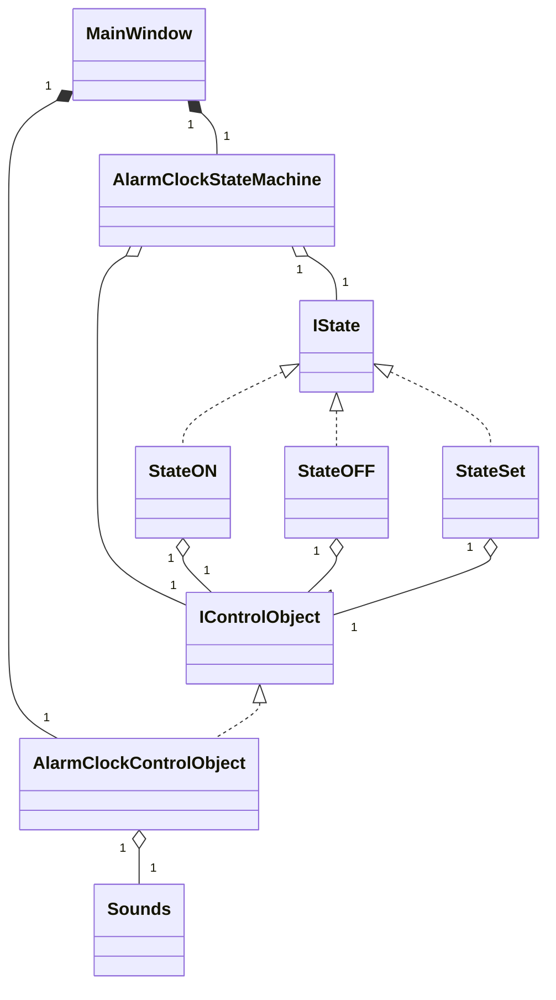
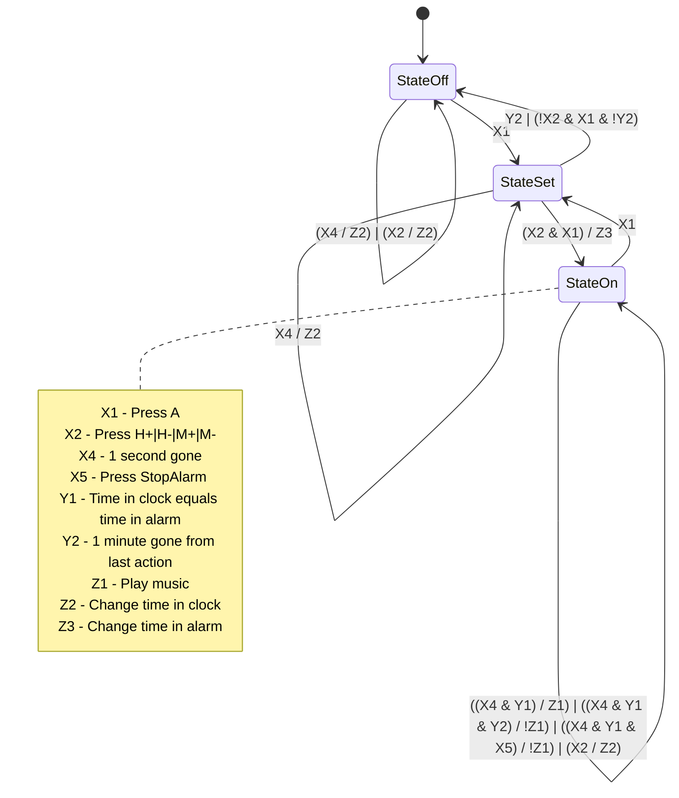

# AlarmClockStateMachine
## Classes Diagram

```mermaid
classDiagram
MainWindow "1" *-- "1" AlarmClockStateMachine
MainWindow "1" *-- "1" AlarmClockControlObject
AlarmClockStateMachine "1" o-- "1" IControlObject
IState <|.. StateON
IState <|.. StateOFF
IState <|.. StateSet
IControlObject <|.. AlarmClockControlObject
AlarmClockStateMachine "1" o-- "1" IState
AlarmClockControlObject "1" o-- "1" Sounds
StateON "1" o-- "1"  IControlObject 
StateOFF "1" o-- "1" IControlObject
StateSet "1" o-- "1" IControlObject
```

## States Diagram

```mermaid
stateDiagram-v2
    [*] --> StateOff
    StateOff --> StateOff : (X4 / Z2) | (X2 / Z2)
    StateOff --> StateSet : X1
    StateSet --> StateSet : X4 / Z2
    StateSet --> StateOff : Y2 | (!X2 & X1 & !Y2) 
    StateSet --> StateOn : (X2 & X1) / Z3
    StateOn --> StateOn : ((X4 & Y1) / Z1) | ((X4 & Y1 & Y2) / !Z1) | ((X4 & Y1 & X5) / !Z1) | (X2 / Z2)
    StateOn --> StateSet : X1
note right of StateOn
    X1 - Press A
    X2 - Press H+|H-|M+|M-
    X4 - 1 second gone
    X5 - Press StopAlarm 
    Y1 - Time in clock equals time in alarm
    Y2 - 1 minute gone from last action
    Z1 - Play music
    Z2 - Change time in clock
    Z3 - Change time in alarm
    end note   
```
---
To `Run` this application in Windows, you must install .Net Desktop Runtime 6.0.3

